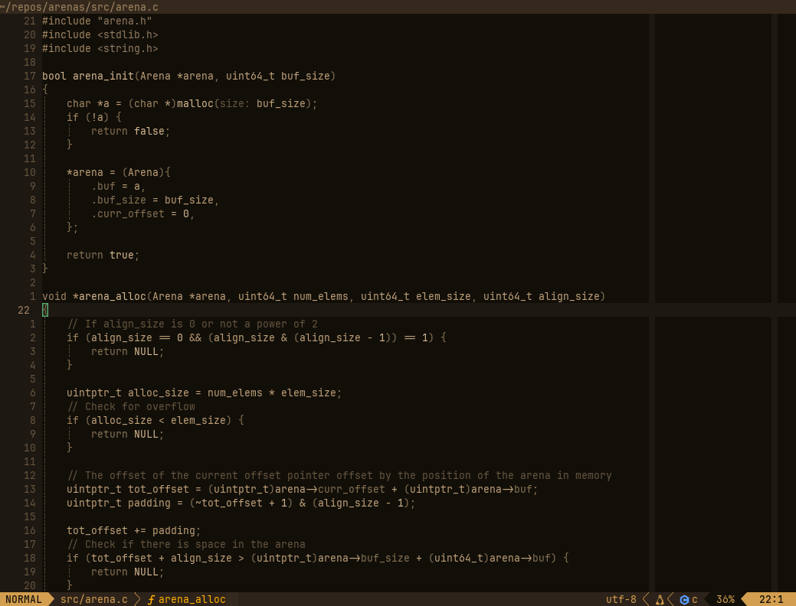
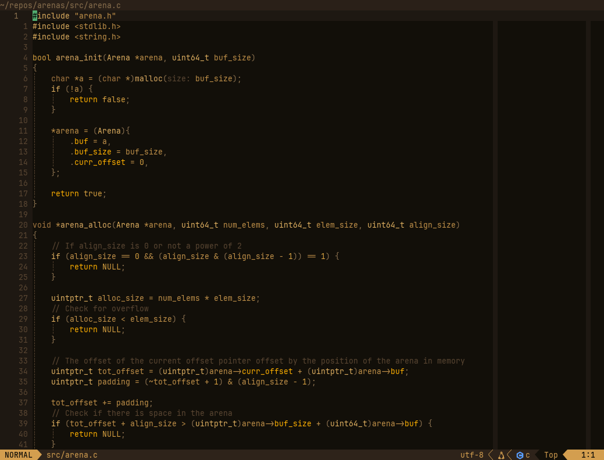
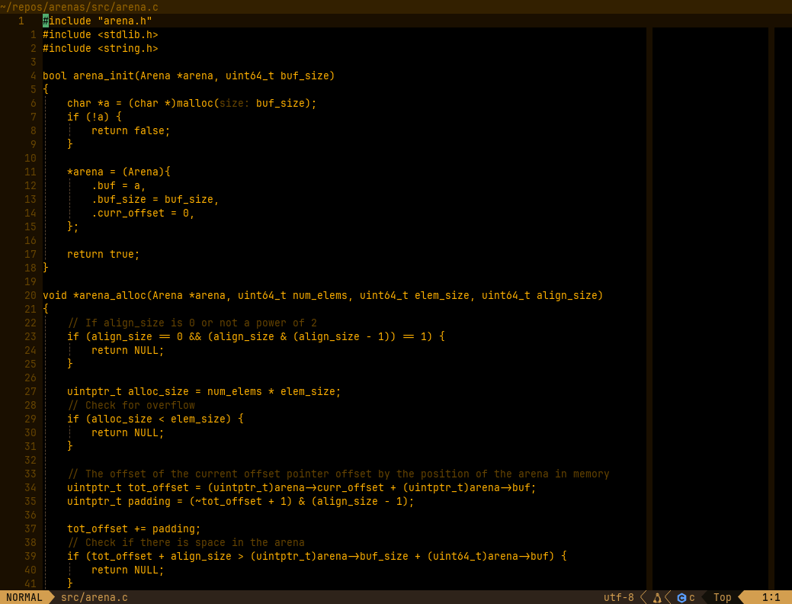

# RetroTerm

A theme attempting to mimic the amber monitors of the 80s such as:

](https://henrylowe.net/2024/12/01/a-1982-usi-pi3-amber-crt-monitor/)
](https://retropaq.com/the-most-powerful-portable-ibm-p75/)
](https://litendeavor.wordpress.com/2015/02/13/love-that-blinking-command-line/)


| Muted | Base (default) | Original |
| -------------------------- | -------------------------- | -------------------------- |
|          |          |  |


## ⚡️ Requirements

- [Neovim](https://github.com/neovim/neovim) >= [0.8.0](https://github.com/neovim/neovim/releases/tag/v0.8.0)
- [mini.nvim](https://github.com/echasnovski/mini.nvim) (installed automatically with Lazy)

## 📦 Installation

Installation with [lazy.nvim](https://github.com/folke/lazy.nvim):

```lua
return {
  'claudemuller/retro-term.nvim',
  lazy = false,
  priority = 1000,
  dependencies = { 'echasnovski/mini.nvim' },
  opts = {},
}
```

## 🚀 Usage

There are a few variants in RetroTerm, namely:

- `original` the closest to the monitors of old
- `base` a more muted version of 'original'
- `muted` an even more muted version of  'original'

Switching palettes can be done with:

```vim
:RetroTermSwitch original
:RetroTermSwitch base
:RetroTermSwitch muted
```

## 🛠️ Configuration

The default palette is `base`. Below is an example on how to specify the palette from config.

```lua
return {
  'claudemuller/retro-term.nvim',
  dependencies = { 'echasnovski/mini.nvim' },
  lazy = false,
  priority = 1000,
  opts = {},
  config = function()
     require('retro-term').setup { variant = 'base' } -- "muted" | "original" | "base"
  end,
}
```

